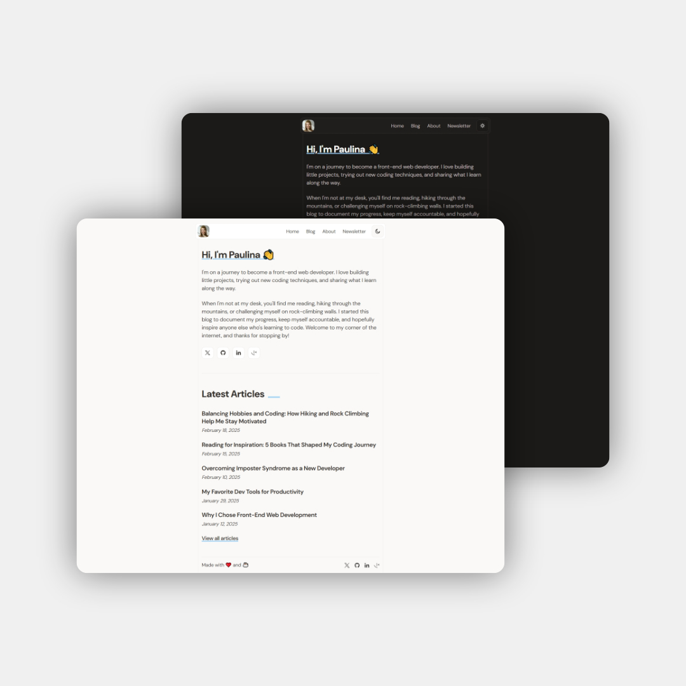

# Frontend Mentor - Personal blog solution

## Overview

### The challenge

Users should be able to:

- Navigate to all pages by clicking links or using their keyboard
- Read all articles
- Select their color theme
- Submit their email to subscribe to the newsletter
- Receive an error message when the newsletter form is submitted if:
  - The Email Address field is empty
  - The Email Address is not formatted correctly
- Receive a success message if submitted correctly
- View the optimal layout for the interface depending on their device's screen size
- See hover and focus states for all interactive elements on the page

### Screenshot



### Links

- Solution URL: [https://github.com/nikosetiawanp/frontendmentor-personal-blog](https://github.com/nikosetiawanp/frontendmentor-personal-blog)
- Live Site URL: [https://nikosetiawanp.github.io/frontendmentor-personal-blog/](https://nikosetiawanp.github.io/frontendmentor-personal-blog/)

## My process

### Built with

[](#)
[](#)
[](#)

### What I learned

- How to use Astro to create blog using markdown file
- Customizing shiki theme to achieve desired code-block look
- How to use version 4 of Tailwind CSS

#### 🚧 Challenges & Solutions

Applying light/dark mode to custom shiki theme is the most challenging part. Because in Shiki and Astro official docs, there's no step-by-step guide to do it. Even if there is, the solution is incomplete. Luckily I found a way to do it, and it's very simple :

I'm using `dark-theme.ts` as an example. Here I'm changing the color of html tags to `#F97583` :

```js
import existingTheme from 'shiki/themes/github-dark.mjs'

export default {
  ...existingTheme,
  type: 'dark',
  name: 'dark-custom',
  tokenColors: [
    ...(existingTheme.tokenColors as any),
    {
      scope: ['entity.name.tag.html', 'entity.name.tag', 'punctuation.definition.tag.html'],
      settings: {
        foreground: '#F97583'
      }
    },
  ]
}
```

After creating `dark-theme.ts`, now import it to `astro.config.mjs`. I have no idea on why we need to add `defaultColor: false` to make light/dark theme work, but it is what it is. Don't forget to add that line if you plan to implement light/dark mode!

```javascript
import { defineConfig } from "astro/config";
import tailwindcss from "@tailwindcss/vite";
import darkTheme from "./src/scripts/dark-theme"; // import it here
import lightTheme from "./src/scripts/light-theme"; // import it here

export default defineConfig({
  output: "static",
  site: "https://nikosetiawanp.github.io",
  base: "frontendmentor-personal-blog",
  vite: {
    plugins: [tailwindcss()],
  },
  markdown: {
    syntaxHighlight: "shiki",
    shikiConfig: {
      themes: {
        light: lightTheme, // use it here
        dark: darkTheme, // use it here
      },
      defaultColor: false, // light/dark theme won't work without this line
    },
  },
});
```

Lastly, add `--shiki-light` and `--shiki-dark` to apply light/dark mode to the project. Also `background-color` to customize the code-block background color.

```css
.astro-code,
.astro-code span {
  color: var(--shiki-light) !important;
  background-color: var(--color-neutral-200) !important;
}
.dark :is(.astro-code, .astro-code span) {
  color: var(--shiki-dark) !important;
  background-color: var(--color-neutral-800) !important;
}
```

### Continued development

There is no plan to continue the development of this project, but feel free to fork this project to learn Astro.

### Useful resources

- [https://docs.astro.build/en/tutorial/6-islands/4/](https://docs.astro.build/en/tutorial/6-islands/4/m) - Use this resource to learn how to create collection for blog posts, and automatically generate pages from the collection

## Author

- Website - [Niko Setiawan P.](https://github.com/nikosetiawanp/)
- Frontend Mentor - [@yourusername](https://www.frontendmentor.io/profile/nikosetiawanp)
